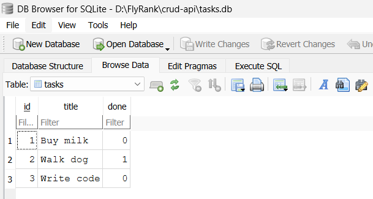
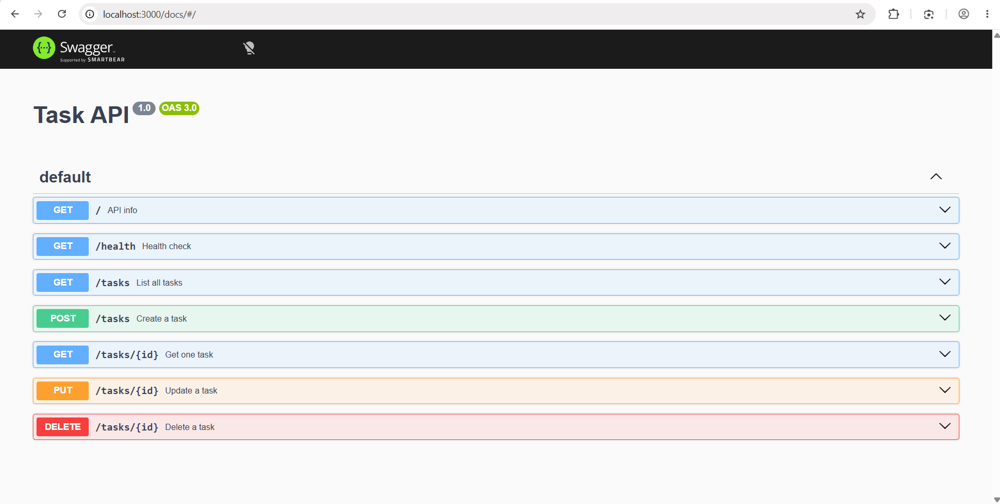

## Docker + PostgreSQL

Runs Postgres in Docker with a named volume. Connection string comes from `.env` (gitignored) — see `.env.example`.

### Run

docker compose up

App: http://localhost:3000 — Swagger: http://localhost:3000/docs

### Persistence check

1. POST a task via Swagger or curl
2. docker compose down
3. docker compose up
4. GET /tasks — the task is still there

### Architecture note

The service and route layer did not change between A2 (SQLite) and A3 (Postgres). Same endpoints, same request bodies, same responses. Only the storage layer swapped.

# Task API

A CRUD API for managing a to-do list, built with Node.js + Express + SQLite.

## Why SQLite

SQLite stores the whole database in a single file (`tasks.db`). No server to install, no setup — perfect for a small API. Data survives server restarts, which in-memory storage can't do.

## Where the database lives

`tasks.db` in the project root. Created automatically on first run.

## Install & run

```bash
npm install
node app.js
```

Server runs at http://localhost:3000 — Swagger UI at http://localhost:3000/docs

## Endpoints

| Method | Path | Description |
|--------|------|-------------|
| GET | / | API info |
| GET | /health | Health check |
| GET | /tasks | List all tasks |
| GET | /tasks/:id | Get one task |
| POST | /tasks | Create a task |
| PUT | /tasks/:id | Update a task |
| DELETE | /tasks/:id | Delete a task |

## Status codes

- 200 — successful read/update
- 201 — task created
- 204 — task deleted
- 400 — invalid body
- 404 — task id not found

## Example curl output

```
$ curl -i http://localhost:3000/tasks/1
HTTP/1.1 200 OK
Content-Type: application/json; charset=utf-8

{"id":1,"title":"Buy milk","done":false}
```

## Example SQL query

```sql
SELECT * FROM tasks WHERE done = 1;
```

Returns only completed tasks.

## Database viewer



## Swagger UI


